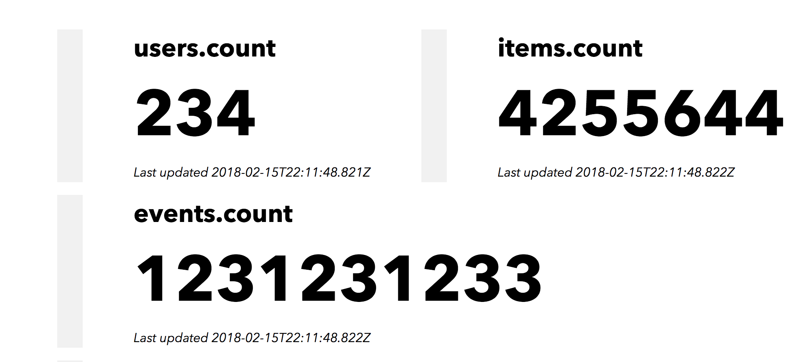

[](https://travis-ci.org/christian-fei/mmonitor) [](https://www.npmjs.com/package/mmonitor) [](package.json) [](http://standardjs.com/) [](https://spdx.org/licenses/ISC)

# mmonitor

mmonitor is a simple tool to monitor mongo queries and aggregations.



## configuration

### env variables

the following environment variables must be set:

```
MONGO_URI
```

optionally:

```
SSE_PORT
```

### monitors.js

create your own `monitors.js` file, starting from `monitors.example.js`.

the structure of a monitor is the following:

```
{
  collection     // string
  type           // 'find', 'distinct', 'aggregate', 'length', 'mapReduce'
  query          // optional query or pipeline
}
```


## installation

```
npm i -g mmonitor
```

## usage

```
MONGO_URI="localhost:27017/work" mmonitor ~/work.monitors.js
MONGO_URI="localhost:27017/project" mmonitor ~/project.monitors.js
```


## development

### installation

```
npm i
npm start
```

### web client

```
cd web
npm i
npm start
```
